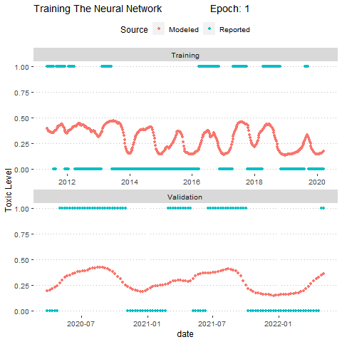
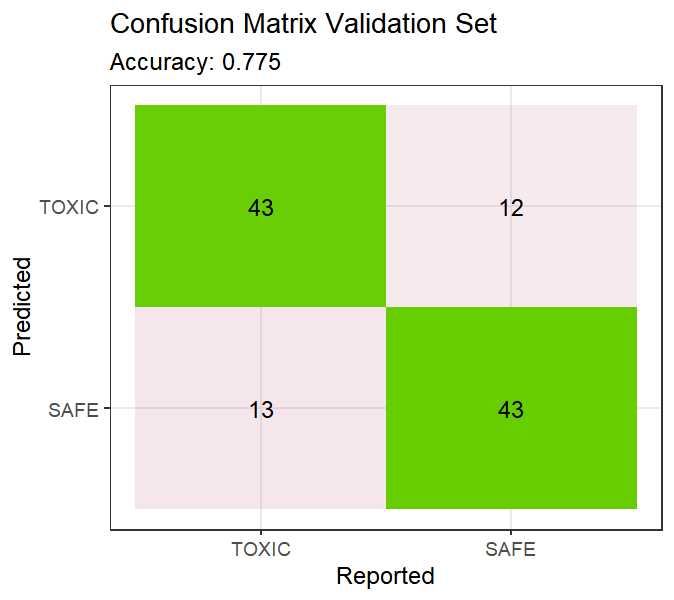
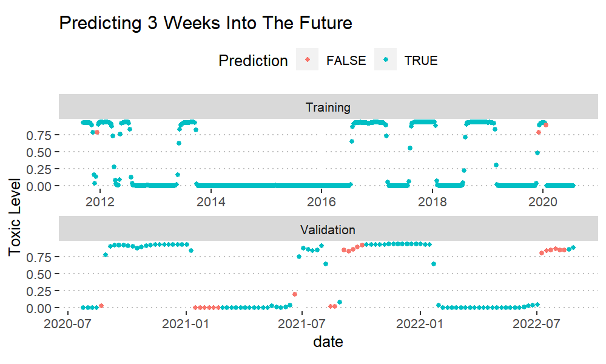
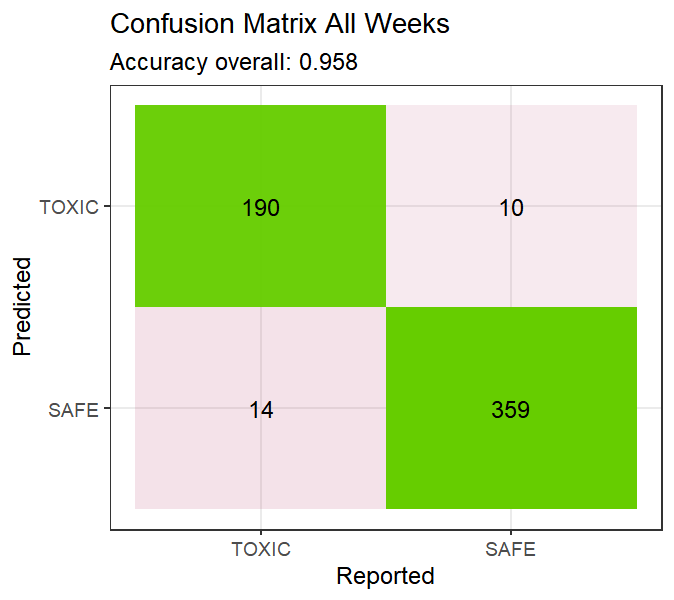
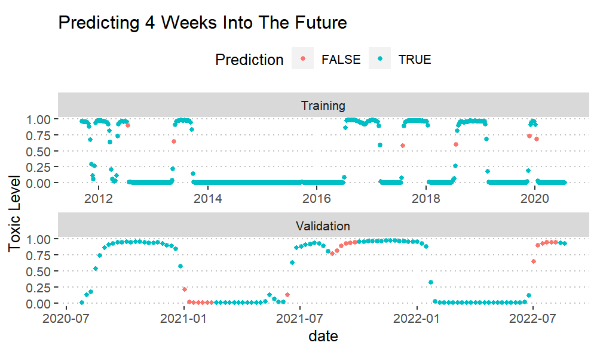
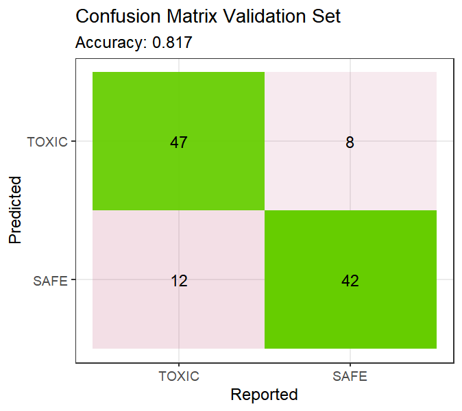

```{r include=FALSE}
library(ggplot2)
library(lubridate)
library(ggpubr)

```


## PREPARING THE RESPONCE VARIABLE/ TOXICITY REPORT

RESPONSE VARIABLE: bureau of fisheries and aquatic resources binary toxicity report
 
The response variable was recorded from a decade of the Philippine bureau of fisheries and aquatic resources that indicates either that a site is safe to harvest and eat shellfish, or if a site has shellfish with a dangerous level of toxin. 
 
Example of one such report is below
 
<center>
{ width=40% }  
</center>
 
These reports are published at an irregular interval about every two weeks. 

This data was summarized into mean 7 day experimental units. 
 
A time series of the binary response variable for the site of interest is printed below. In essence, this is what we were trying to predict

```{r echo=FALSE}

data = read.csv("MatarianoBayMaster.csv")

data$date = mdy(data$date)


ggplot(data, aes(x = date, y = sitebi)) +
  geom_point() +
  theme_pubclean()+
  labs(y = "Toxic Level ",title = "Reported values of toxicity at Matariano Bay for the last 11 years")


```


In this case, 1 represents when a report was released claiming that the shellfish at Matarinao Bay are above the toxic level for consumption and 0 represents when the shellfish tested at Matariano Bay are free of toxins 


## COLLECTING CO-VARIETS

Because the Philippines has very little consistent environmental data that goes back 10 years, and because the model requires no missing data, a global numerical model was used, namely HYCOM. 
 
HYCOM simulates Water temp, salinity, velocity and height. This is offered at various depths and the surface. For the sake of this project, these variables were collected near shore and far shore at the surface and at a depth of 2000 meters. 

Google earth engine (GEE) was used to collect this data. Specifically the R package - RGEE - was used which allows access to the GEE servers through R. 

Spatial data like the one pictured below was collected and the mean was taken

<center>
.png){ width=60% }  
</center>

The above picture shows the three zones that data was collected. The black polygons show where the near and far HYCOM data was taken while the blue square shows where atmospheric data was collected. Namely the [NASA GES DISC Goddard Global Precipitation Measurement](https://developers.google.com/earth-engine/datasets/catalog/NASA_GPM_L3_IMERG_V06)


The data structure of the input variables generally looked like the flowing, a 2D matrix where each colum is a different environmental variable or derived variable, and each row is the weekly mean  going back in time. 


```{r echo=FALSE}

data = data[,c(-1,-2, -4)]
data = data[,c( 3 ,5,10, 11, 14 ,15,16,17,19)]

colnames(data) =  c("rain", "salinity_close", "Velocity_v_far" , "Velocity_u_far", "Velocity_v_deep", "Velocity_u_deep", "doy", "Elevation_close", "Temp_Annomoly_Close")


data[25:34, ]


```

These were the variables used in the final model. Each row represents a week back in time. 


## TRAINING THE NURAL NET


A deep learning artificial neural network was used to predict the binary response variable of the toxicity of the site. Many different parameters go into the structure of the model. The number of layers, number of nodes per layer, input data size, prediction variable lag and drop out rate were all chosen after many trial and error test. 
 
The 11 years of data was split into 9 and 2 years for training and validation. The first 9 years were used for training and the last 2 years as a validation set.    


Below is an animation of the training of the model. The predicted values and reported values are shown. 

<center>
{ width=60% }  
</center>


## RESULTS


Surprisingly, out of the three models below, the one with the least amount of lag between the prediction interval (two weeks) is the worst. The best preforming model is the one that predicts four weeks into the future. 

The three plots shows the performance of the model on the entire data set with distinctions being made between the training and validation sets. The model has never seen the validation set and therefore should be have a higher weight when evaluating performance. 

<center>
{ width=75% }
</center>


<center>
{ width=39% } { width=39% }
</center>


## -


<center>
{ width=75% }
</center>


<center>
{ width=39% } { width=39% }
</center>


## -


<center>
{ width=75% }
</center>


<center>
{ width=39% } { width=39% }
</center>


## -


